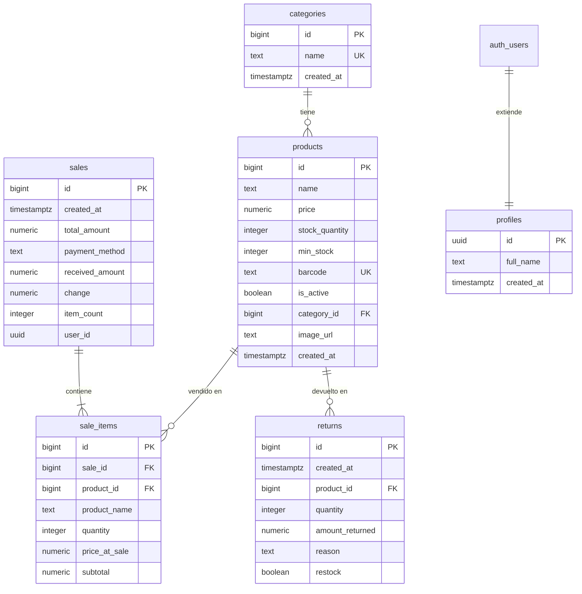

<p align="center">
  
</p>

<h1 align="center">QuickInvent</h1>

<p align="center">
  <strong>Sistema de Punto de Venta e Inventario</strong><br/>
  Aplicación multiplataforma desarrollada en Flutter para la gestión integral de inventarios, ventas y reportes en pequeños y medianos negocios.
</p>

<p align="center">
  
  
  
  
  
</p>

---

## 📋 Tabla de Contenido

- [Descripción](#-descripción)
- [Características](#-características)
- [Stack Tecnológico](#-stack-tecnológico)
- [Arquitectura](#-arquitectura)
- [Estructura del Proyecto](#-estructura-del-proyecto)
- [Esquema de Base de Datos](#-esquema-de-base-de-datos)
- [Dependencias](#-dependencias)
- [Requisitos Previos](#-requisitos-previos)
- [Instalación y Configuración](#-instalación-y-configuración)
- [Ejecución](#-ejecución)
- [Capturas de Pantalla](#-capturas-de-pantalla)
- [Licencia](#-licencia)

---

## 📝 Descripción

**QuickInvent** nace de la necesidad de simplificar y automatizar la gestión de inventario y ventas en negocios que aún dependen de procesos manuales (libretas, hojas de cálculo, etc.). La aplicación permite registrar productos, controlar stock en tiempo real, realizar ventas a través de un punto de venta (POS) integrado, gestionar devoluciones y generar reportes detallados — todo desde una interfaz moderna y fácil de usar.

### Problema que resuelve

Muchos pequeños negocios carecen de un sistema accesible y económico para el control de inventario y ventas. Esto genera:

- Errores frecuentes en el conteo de stock
- Pérdida de productos por falta de seguimiento
- Desconocimiento de las ventas reales y márgenes de ganancia
- Procesos lentos y propensos a errores humanos

QuickInvent soluciona estos problemas con una herramienta digital integral, accesible y multiplataforma.

---

## ✨ Características

| Módulo                           | Funcionalidades                                                                                                                                   |
| --------------------------------- | ------------------------------------------------------------------------------------------------------------------------------------------------- |
| **📦 Inventario**           | CRUD de productos, categorías, stock mínimo, alertas de stock bajo, búsqueda y filtrado avanzado, importación/exportación CSV y Excel        |
| **🛒 Punto de Venta (POS)** | Carrito de compras, cobro con cálculo de cambio, múltiples métodos de pago, ventas suspendidas/retenidas, teclado numérico integrado          |
| **📊 Reportes**             | Dashboard con estadísticas, ventas por período, productos más vendidos, ventas por categoría, stock muerto, gráficas interactivas (fl_chart) |
| **📷 Escáner**             | Escaneo de códigos de barras y QR con la cámara del dispositivo (mobile_scanner)                                                                |
| **🏷️ Códigos de Barras** | Generación e impresión de etiquetas con código de barras para productos                                                                        |
| **🔄 Devoluciones**         | Registro de devoluciones con motivo, restock automático opcional                                                                                 |
| **👥 Clientes**             | Gestión de base de datos de clientes                                                                                                             |
| **🔐 Autenticación**       | Registro e inicio de sesión con Supabase Auth, perfiles de usuario                                                                               |
| **🎨 Temas**                | Modo claro y oscuro con persistencia de preferencias                                                                                              |
| **🖨️ Tickets**            | Generación de tickets de venta en PDF para impresión                                                                                            |
| **⚙️ Configuración**     | Ajustes de negocio, preferencias de la aplicación                                                                                                |

---

## 🛠️ Stack Tecnológico

| Capa                  | Tecnología         | Propósito                                               |
| --------------------- | ------------------- | -------------------------------------------------------- |
| **Frontend**    | Flutter / Dart      | Framework UI multiplataforma                             |
| **Estado**      | Riverpod            | Gestión de estado reactiva                              |
| **Backend**     | Supabase            | Base de datos PostgreSQL, autenticación, almacenamiento |
| **BD Local**    | Drift (SQLite)      | Caché local y modo offline                              |
| **Navegación** | Go Router           | Enrutamiento declarativo                                 |
| **Gráficas**   | FL Chart            | Visualización de datos y reportes                       |
| **PDF**         | pdf + printing      | Generación e impresión de tickets y reportes           |
| **Escáner**    | mobile_scanner      | Lectura de códigos de barras y QR                       |
| **Animaciones** | animate_do + Lottie | Micro-animaciones y transiciones                         |

---

## 🏗️ Arquitectura

El proyecto sigue el patrón **MVVM (Model-View-ViewModel)** con la siguiente separación de responsabilidades:

```
┌─────────────────────────────────────────────────┐
│                    VIEWS                        │
│             (screens/ + widgets/)               │
│          UI y presentación visual               │
├─────────────────────────────────────────────────┤
│                 VIEWMODELS                      │
│               (providers/)                      │
│    Lógica de negocio + estado (Riverpod)        │
├─────────────────────────────────────────────────┤
│                   MODEL                         │
│          (models/ + repositories/)              │
│     Entidades de datos + acceso a datos         │
├─────────────────────────────────────────────────┤
│                 SERVICES                        │
│               (services/)                       │
│    Sincronización, utilidades transversales     │
├─────────────────────────────────────────────────┤
│                DATA SOURCES                     │
│        Supabase (remoto) + Drift (local)        │
└─────────────────────────────────────────────────┘
```

### Patrones de Diseño Aplicados

- **Repository Pattern** — Abstracción del acceso a datos (Supabase / Drift)
- **Provider Pattern** — Inyección de dependencias y estado reactivo con Riverpod
- **Observer Pattern** — Reactividad en la UI mediante `ConsumerWidget` / `ref.watch()`
- **Singleton** — Instancia única del cliente Supabase

---

## 📂 Estructura del Proyecto

```
quickinvent/
├── lib/
│   ├── main.dart                 # Punto de entrada de la aplicación
│   ├── database/                 # Configuración de Drift (SQLite local)
│   ├── dialogs/                  # Diálogos reutilizables
│   ├── models/                   # Modelos de datos (Product, Sale, Category, etc.)
│   ├── providers/                # Providers de Riverpod (ViewModels)
│   ├── repositories/             # Repositorios de acceso a datos
│   │   ├── auth_repository.dart
│   │   ├── customers_repository.dart
│   │   ├── products_repository.dart
│   │   └── sales_repository.dart
│   ├── screens/                  # Pantallas de la aplicación
│   │   ├── login_screen.dart
│   │   ├── register_screen.dart
│   │   ├── inventory_screen.dart
│   │   ├── pos_screen.dart
│   │   ├── cash_register_screen.dart
│   │   ├── reports_screen.dart
│   │   ├── sales_history_screen.dart
│   │   ├── returns_screen.dart
│   │   ├── scanner_screen.dart
│   │   ├── settings_screen.dart
│   │   └── ...
│   ├── services/                 # Servicios (sincronización, etc.)
│   ├── theme/                    # Definición de temas (claro/oscuro)
│   ├── utils/                    # Utilidades y helpers
│   └── widgets/                  # Widgets reutilizables
│       ├── app_shell.dart
│       ├── app_sidebar.dart
│       ├── auth_gate.dart
│       ├── splash_screen.dart
│       ├── premium_widgets.dart
│       └── ...
├── assets/                       # Recursos (logos, multimedia)
├── android/                      # Configuración nativa Android
├── windows/                      # Configuración nativa Windows
├── web/                          # Configuración Web
├── documentacion/                # Documentación del proyecto (PDF)
├── supabase_schema.sql           # Esquema completo de la base de datos
├── pubspec.yaml                  # Dependencias y configuración del proyecto
└── README.md                     # Este archivo
```

---

## 🗄️ Esquema de Base de Datos

La base de datos está alojada en **Supabase (PostgreSQL)** con Row Level Security (RLS) habilitado.



> El esquema SQL completo se encuentra en [`supabase_schema.sql`](supabase_schema.sql).

---

## 📦 Dependencias

### Producción

| Paquete                  | Versión | Propósito                                |
| ------------------------ | -------- | ----------------------------------------- |
| `supabase_flutter`     | ^2.5.3   | Cliente Supabase (Auth, DB, Storage)      |
| `flutter_riverpod`     | ^3.3.1   | Gestión de estado reactiva               |
| `go_router`            | ^17.2.3  | Enrutamiento declarativo                  |
| `drift`                | ^2.16.0  | ORM SQLite para caché local              |
| `drift_flutter`        | ^0.2.0   | Integración Drift con Flutter            |
| `sqlite3_flutter_libs` | ^0.5.20  | Binarios SQLite nativos                   |
| `fl_chart`             | ^1.2.0   | Gráficas interactivas                    |
| `pdf`                  | ^3.10.8  | Generación de documentos PDF             |
| `printing`             | ^5.12.0  | Impresión de PDFs                        |
| `mobile_scanner`       | ^7.2.0   | Escaneo de códigos de barras/QR          |
| `barcode_widget`       | ^2.0.4   | Renderizado de códigos de barras         |
| `barcode`              | ^2.2.8   | Generación de códigos de barras         |
| `qr_flutter`           | ^4.1.0   | Generación de códigos QR                |
| `image_picker`         | ^1.1.2   | Selección de imágenes                   |
| `cached_network_image` | ^3.4.1   | Caché de imágenes de red                |
| `file_picker`          | ^11.0.2  | Selector de archivos                      |
| `file_saver`           | ^0.3.1   | Guardado de archivos                      |
| `file_selector`        | ^1.0.3   | Selector de archivos nativo               |
| `csv`                  | ^8.0.0   | Procesamiento de archivos CSV             |
| `excel`                | ^4.0.5   | Lectura/escritura de archivos Excel       |
| `intl`                 | ^0.20.2  | Internacionalización y formato de fechas |
| `shared_preferences`   | ^2.2.3   | Almacenamiento de preferencias            |
| `path_provider`        | ^2.1.2   | Rutas del sistema de archivos             |
| `path`                 | ^1.9.0   | Manipulación de rutas                    |
| `animate_do`           | ^3.3.4   | Animaciones predefinidas                  |
| `shimmer`              | ^3.0.0   | Efecto shimmer para carga                 |
| `lottie`               | ^3.3.0   | Animaciones Lottie                        |
| `audioplayers`         | ^6.6.0   | Reproducción de audio                    |
| `video_player`         | ^2.11.1  | Reproducción de video                    |

### Desarrollo

| Paquete           | Versión | Propósito                      |
| ----------------- | -------- | ------------------------------- |
| `flutter_test`  | SDK      | Framework de testing            |
| `drift_dev`     | ^2.16.0  | Generador de código para Drift |
| `build_runner`  | ^2.4.8   | Generación de código          |
| `flutter_lints` | ^6.0.0   | Reglas de análisis estático   |

---

## 📋 Requisitos Previos

- **Flutter SDK** ≥ 3.11.1
- **Dart SDK** ≥ 3.11.1
- **Git**
- Una cuenta en [Supabase](https://supabase.com/) (para el backend)
- **Android Studio** o **Visual Studio** (según la plataforma destino)

---

## 🚀 Instalación y Configuración

### 1. Clonar el repositorio

```bash
git clone https://github.com/JareT-rgb/quickinvent.git
cd quickinvent
```

### 2. Instalar dependencias

```bash
flutter pub get
```

### 3. Configurar Supabase

1. Crea un nuevo proyecto en [Supabase](https://supabase.com/)
2. Ejecuta el esquema SQL en el editor de Supabase:
   ```
   supabase_schema.sql
   ```
3. Actualiza las credenciales en `lib/main.dart`:
   ```dart
   await Supabase.initialize(
     url: 'TU_SUPABASE_URL',
     anonKey: 'TU_ANON_KEY',
   );
   ```

### 4. Generar código (Drift)

```bash
dart run build_runner build --delete-conflicting-outputs
```

---

## ▶️ Ejecución

```bash
# Windows
flutter run -d windows

# Android
flutter run -d android

# Web
flutter run -d chrome

# Modo debug (cualquier dispositivo disponible)
flutter run
```

---

## 👤 Autor

Desarrollado como proyecto académico.
