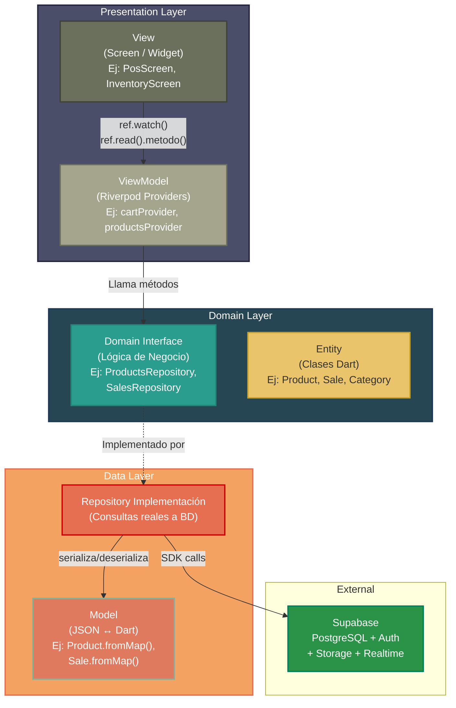

# Diagrama de Arquitectura MVVM - QuickInvent

Aquí tienes el diagrama de la arquitectura de tu proyecto (QuickInvent) basado en el modelo MVVM que proporcionaste, adaptado con las tecnologías y clases que realmente estamos usando (Riverpod en lugar de ChangeNotifier, y tus entidades reales).

Puedes copiar este código Mermaid en tu documentación o en herramientas como [Mermaid Live Editor](https://mermaid.live/) para generar la imagen.

## Explicación de las Capas en QuickInvent:

1. **Presentation Layer (Capa de Presentación)**: 
   * **View**: Son tus pantallas en `lib/screens/` (ej. `pos_screen.dart`).
   * **ViewModel**: En lugar de usar el clásico `ChangeNotifier`, en QuickInvent usamos **Riverpod** (`lib/providers/`). Los widgets se comunican con el estado usando `ref.watch()` para reaccionar a cambios, y `ref.read().accion()` para disparar eventos (ej. agregar al carrito).

2. **Domain Layer (Capa de Dominio)**:
   * **Interface / Repository**: Son las clases en `lib/repositories/` (ej. `ProductsRepository`). Definen qué operaciones se pueden hacer (obtener productos, registrar venta).
   * **Entity**: Son tus objetos puros de negocio en `lib/models/` (ej. `Product`, `Sale`, `Category`).

3. **Data Layer (Capa de Datos)**:
   * **Repository Implementación**: Es el código interno de tus repositorios que hace las llamadas reales (`_client.from('products').select()`).
   * **Model (Serialización)**: Son las funciones `fromMap()` y `toMap()` dentro de tus entidades que convierten el JSON de la base de datos a objetos de Dart.

4. **External**: 
   * El Backend como Servicio (BaaS) que estamos usando: **Supabase**, que maneja la base de datos PostgreSQL, la autenticación, el almacenamiento de imágenes (Storage) y las actualizaciones en tiempo real (como los escaneos de códigos de barras).
